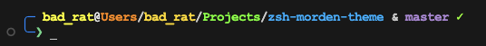
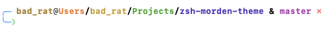

# Modern ZSH Theme

A sleek and modern ZSH theme that automatically adapts to light and dark terminal themes. This theme provides a clean and informative prompt with git integration, command execution time, and a beautiful rainbow directory path.




## Features

- 🌗 **Automatic Theme Detection**: Automatically switches between light and dark color schemes
- 🌈 **Rainbow Directory Path**: Each directory level has its own color for better visibility
- 🔄 **Git Integration**:
  - Shows current branch name
  - Displays repository status (clean/dirty)
  - Uses distinct symbols (✓/✗) for status indication
- ⏱️ **Command Execution Timer**: Shows how long each command took to execute
- 👤 **User Context**: Displays username
- ❌ **Error Indication**: Changes prompt color on command failure
- 🎨 **Color Optimized**: Carefully selected colors for both light and dark themes
- 🖥️ **Terminal Support**:
  - Apple Terminal
  - iTerm2
  - GNOME Terminal
  - Konsole
  - Support for tmux and screen

## Installation

### Prerequisites

- ZSH shell
- Git (optional, for git status features)

### Manual Installation

1. Clone the repository:

```bash
git clone https://github.com/BadRat-in/zsh-modern-theme.git $HOME/.zsh/zsh-modern-theme
```

2. Set the theme in your `~/.zshrc`:

```bash
source $HOME/.zsh/zsh-modern-theme/modern-theme.zsh
```

3. Reload your configuration:

```bash
source ~/.zshrc
```

## Customization

You can customize various aspects of the theme by modifying the variables in `modern-theme.zsh`:

### Colors

The theme automatically selects appropriate colors for light and dark themes, but you can customize them:

```sh
# For dark theme
typeset -g PROMPT_COLOR=$'%F{033}'    # Change prompt color
typeset -g USER_COLOR=$'%F{226}'      # Change username color
# ... more color variables available

# For light theme
typeset -g PROMPT_COLOR=$'%F{020}'    # Change prompt color for light theme
# ... more color variables available
```

### Git Symbols

```sh
typeset -g GIT_CLEAN_SYMBOL='✓'       # Change clean repository symbol
typeset -g GIT_DIRTY_SYMBOL='✗'       # Change dirty repository symbol
typeset -g GIT_PREFIX=' & '           # Change prefix before git branch
```

## Contributing

Contributions are welcome! Please feel free to submit a Pull Request. For major changes, please open an issue first to discuss what you would like to change.

## License

This project is licensed under the MIT License - see the [LICENSE](LICENSE) file for details.

## Author

**Ravindra Singh**

- GitHub: [@BadRat-in](https://github.com/BadRat-in)

## Acknowledgments

- Inspired by various ZSH themes in the community
- Special thanks to the Oh My Zsh project
